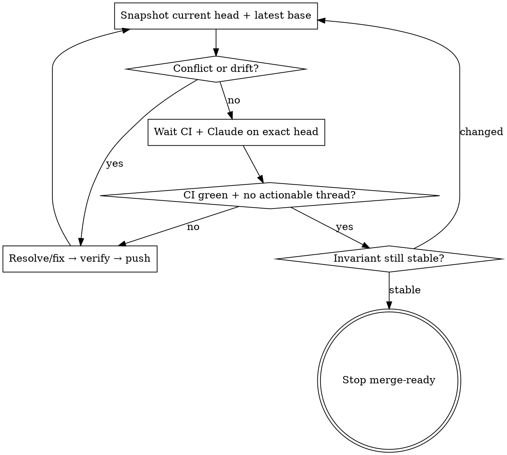

# Closing PR Review Loops

## Overview

Drive an authorized PR to a stable, merge-ready head. Evidence is valid only for the exact current head SHA; every push or base update restarts the affected gates.

**Core invariant:** stop only when the unchanged remote head is conflict-free against the latest base, required CI is green, Claude PR Review is complete for that head, and no actionable unresolved thread remains. Do not merge unless explicitly requested.

**REQUIRED REFERENCE:** Read `references/loop-contract.md` before acting.

**REQUIRED SUB-SKILLS:**
- `github:gh-address-comments` for thread-aware reads, replies, and resolution
- `github:gh-fix-ci` for failing GitHub Actions
- `superpowers:receiving-code-review` before accepting feedback
- `superpowers:test-driven-development` for behavioral fixes
- `superpowers:verification-before-completion` before push or completion claims
- `superpowers:dispatching-parallel-agents` for independent write lanes

## Authority Gate

Confirm authority for push, replies, and thread resolution. Without it, remain read-only and draft actions. Never merge, force-push, or change PR state beyond granted authority.

## Outer Loop

## Non-Negotiable Rules

1. Bind CI, approvals, and reviews to the exact remote head SHA; old-head evidence is stale.
2. Wait for current-head Claude review even when it is not a branch-required check.
3. Evaluate reviewer claims against code, tests, and design; do not accept bot comments blindly.
4. Resolve conflicts semantically. Never blanket-select ours/theirs or rewrite a shared branch.
5. Use one integrator or a serialized push gate; re-verify imported subagent work.
6. After every push, restart the SHA-bound loop. Cycle count is never a stop condition.
7. Stop merge-ready, not merged, unless merge authority was explicit.

## Stop Contract

All must hold for one unchanged remote head: latest base fetched; no merge conflict; local and remote heads agree; required CI succeeds for that SHA; Claude review is terminal and current; actionable unresolved threads are zero; other threads have evidence-backed dispositions; no fix, commit, push, or verification remains.

## Red Flags

- “The old SHA was green.”
- “Claude is optional, so skip it.”
- “Two rounds are enough.”
- “CI will catch blanket conflict resolution.”
- “Let every agent push the shared branch.”
- “No actionable comments means done” while another gate is pending.
