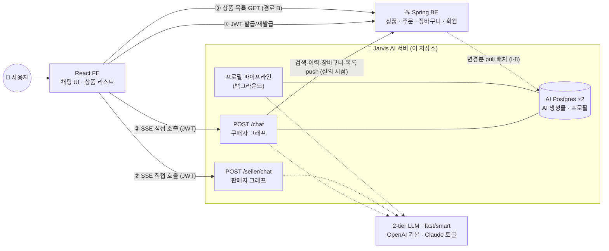

# 🛒 Jarvis — 에이전틱 커머스 AI 서버

> 자연어 대화로 상품을 추천하고 장바구니에 담아주는 **에이전틱 커머스(Agentic Commerce)** AI 에이전트 서버.
> 구매자·판매자 양쪽을 위한 LangGraph 멀티 에이전트와 개인화 프로필 파이프라인을 제공한다.

<p>
  
  
  
  
  
  
  
  
</p>

---

## 📌 프로젝트 개요

일반 커머스 검색은 **키워드 매칭**에 머문다. Jarvis는 사용자의 자연어 의도("유럽 여행 가는데 기내 반입 되는 파우치 추천해줘")를 구조화 필터 + 시맨틱 쿼리로 분해하고, 개인 취향 프로필로 재랭킹해 **근거와 함께** 상품을 제안한다. "담아줘" 한마디로 장바구니까지 이어지는 **대화형 쇼핑 경험**이 목표다.

이 저장소는 3-tier 아키텍처 중 **AI 에이전트 서버**를 담당한다 (React 프론트엔드 · Spring 백엔드는 별도).

| 역할 | 담당 |
|---|---|
| **AI 서버 (이 저장소)** | 대화형 추천/장바구니 에이전트, 판매자 챗봇, 개인화 프로필, 상품 시맨틱 인덱싱 |
| React 프론트엔드 | 채팅 UI, 상품 리스트 렌더, SSE 스트림 소비 |
| Spring 백엔드 | 회원·상품·주문·장바구니 등 커머스 트랜잭션, 상품 원본 데이터 소유 |

### 핵심 기능

- 🔎 **대화형 상품 추천** — 의도 분해 → 검색 → 프로필 재랭킹 → 근거 생성 (멀티턴 조건 누적·완화)
- 🛍️ **자연어 장바구니** — "담아줘" 의도 확정 + 옵션 되물음 + 장바구니 조회, 게스트 지원
- 📊 **판매자 챗봇** — 매출/판매 통계 Q&A + 상품 상세 수정 draft 제안
- 🧠 **개인화 프로필 파이프라인** — 대화·구매 이력에서 취향 신호를 추출해 백그라운드로 축적 (OKF 스타일 자연어 위키)
- ⚡ **SSE 실시간 스트리밍** — 토큰 단위 응답, 취소·타임아웃·동시 스트림 제어

---

## 🏗️ 시스템 아키텍처



**설계 하이라이트**

- **FE ↔ AI 직접 호출** — FE가 Spring에서 발급받은 JWT로 AI 서버를 직접 호출(SSE). AI는 `RS256 + JWKS`로 토큰을 로컬 검증하고, **신원은 요청 본문이 아닌 JWT `sub` 클레임에서만** 도출한다(IDOR 방지).
- **경로 B (상품 리스트 분리)** — SSE에는 상품 카드를 싣지 않는다. AI가 랭크 목록을 Spring에 push하면 FE가 Spring에서 가격·이미지·리뷰수가 채워진 목록을 GET. 표시 데이터의 권위를 Spring에 일원화.
- **질의 시점 검색 위임** — AI는 상품 원본 사본을 두지 않고, 질의 시점에 Spring 검색을 위임해 최신 가격·재고를 확보한다. AI Postgres에는 **AI 생성물(extras·search_doc·임베딩)만** 저장.
- **데이터 소유 분리** — 커머스 원본은 Spring/MySQL, AI 산출물은 AI/PostgreSQL(pgvector). 동기화는 이벤트가 아닌 **pull 배치**(`GET /products/changes`).

---

## 🧰 기술 스택 & 선택 이유

| 영역 | 기술 | 선택 이유 |
|---|---|---|
| 언어/런타임 | **Python 3.12** | LLM·에이전트 생태계 표준, 타입 힌트 성숙 |
| 웹 프레임워크 | **FastAPI** + Uvicorn | async 네이티브 → SSE 스트리밍·동시 LLM 호출에 적합 |
| 에이전트 오케스트레이션 | **LangGraph** | 조건부 분기·멀티턴 상태·checkpointer를 그래프로 명시. intent router → 서브그래프 구조에 자연스러움 |
| LLM | **2-tier provider 토글**<br/>(fast/smart · `LLM_PROVIDER`) | 호출부는 tier(fast/smart) 추상화, provider가 모델 해석. 기본 **OpenAI**(gpt-5-nano/gpt-5.6-luna) · **Claude**(haiku/sonnet) 토글. 비용/품질 분리 — 라우팅·분해·enrichment=fast, 재랭킹·응답=smart |
| 데이터베이스 | **PostgreSQL ×2** + pgvector | 정확 필터(WHERE) + 벡터 유사도를 단일 SQL로. 카탈로그 인덱스 / 프로필 스토어 분리 |
| 임베딩 | **한국어 특화 오픈소스**<br/>(self-host, 1024-dim, CPU) | 한국어 커머스 도메인 품질 + 비용 통제. `snowflake-arctic-embed-l-v2.0-ko` |
| 인증 | **PyJWT + RS256/JWKS** | Spring 발급 토큰의 무상태 로컬 검증 (JWKS 공개키 캐싱) |
| 상태 저장 | **LangGraph PostgresSaver** | 멀티턴 대화·세션 종료 기반 프로필 트리거 |
| 패키지 관리 | **uv** | 빠른 의존성 해석, 임베딩(torch) 선택적 그룹 분리 |
| 검증 | **Pydantic v2** (CamelModel) | 와이어 포맷 camelCase ↔ 파이썬 snake_case 자동 정합 |

---

## 💡 주요 기술적 도전 & 설계 결정

포트폴리오 관점에서 특히 고민한 지점들 — 상세 의사결정 로그는 [`docs/`](docs/)와 기획 저장소 결정 원장 참조.

1. **동기화 방식: 이벤트(CDC) vs 배치** — 실시간 웹훅 대신, AI가 필요 시 당겨오는 **pull 배치**로 확정. Spring의 스케줄러·재시도 부담을 없애고, 유실 시 다음 주기가 자연 복구. 상품 원본은 복제하지 않고 AI 생성물만 upsert.
2. **검색 아키텍처 OPEN** — ①AI 벡터 검색 → Spring id 조회 ②Spring 검색 → 임베딩 재랭킹, 두 방식을 `SearchBackend` 인터페이스 뒤에 두고 **골든셋 실측으로 확정**하도록 교체 가능하게 설계.
3. **SSE 스트림 수명주기** — 세션당 활성 스트림 1개(`409`), 클라이언트 취소(`AbortController`) 감지 시 **LLM 스트림 즉시 중단(토큰 비용 차단)**, 계층별 타임아웃, 대화 저장 상태(`COMPLETED/FAILED/CANCELLED`) 관리.
4. **개인화 프로필** — 매 발화 저장이 아닌 **반복성·현저성·명시성 게이트** 통과 시에만 승격, 세션 종료 후 sleep-time 배치로 병합. 저장 포맷은 OKF 스타일 자연어 위키.
5. **계약 우선 개발** — 3팀 병렬 개발을 위해 API 계약(`api-spec`)을 코드보다 먼저 확정하고 버전 관리. 스텁마다 `api-spec §` 참조 주석으로 코드↔명세를 연결.

---

## 📂 프로젝트 구조

```
app/
├── main.py              # FastAPI 팩토리 — CORS + 라우터 + /health
├── api/                 # 엔드포인트: chat · seller · profile · events + 인증 deps
├── agents/
│   ├── buyer/           # 구매자 그래프 + 서브그래프(recommendation · cart · fallback)
│   ├── seller/          # 판매자 챗봇 그래프 (통계 Q&A + draft)
│   └── profile/         # 프로필 reader · builder · gate (백그라운드)
├── core/                # config(설정 주입) · auth(RS256/JWKS) · logging
├── services/            # search_service(교체형 백엔드) · spring_client(역방향 호출)
├── pipelines/           # AI 생성물 배치 — enrichment · embedding · 초기 구축
└── schemas/             # Pydantic 요청/응답 · SSE 페이로드 · Spring 계약 모델
db/catalog/init/         # 초기 SQL
deploy/                  # 데모 docker-compose + 시드
tests/                   # pytest (unit · integration)
```

---

## 🚀 시작하기

```bash
# 1. 의존성 설치 (임베딩 그룹은 배치 실행 시에만: uv sync --group embedding)
uv sync

# 2. PostgreSQL ×2 기동 (catalog=5433, profile=5434)
docker compose up -d pg-catalog pg-profile

# 3. 환경변수 (.env.example → .env 복사 후 채움)
cp .env.example .env

# 4. 개발 서버 실행 (AUTH_MODE=dev: 헤더 없으면 게스트)
uv run uvicorn app.main:app --reload

# 5. Git hook 설치 (1회 — 커밋 시 lint + 커밋 메시지 형식 자동 검사)
uv run pre-commit install

# 6. 테스트 · 린트
uv run pytest
uv run ruff check
```

- 헬스 체크: `GET http://localhost:8000/health`
- API 문서: `http://localhost:8000/docs` (FastAPI 자동 생성)

### API 요약

| 메서드 | 경로 | 설명 |
|---|---|---|
| POST | `/chat` | 구매자 챗봇 (SSE) — 추천 · 장바구니 · 폴백 |
| POST | `/seller/chat` | 판매자 챗봇 (SSE) — 통계 Q&A · draft, 판매자 스코프 필수 |
| GET | `/profile/me` | 마이페이지 프로필 조회 |
| POST | `/events/session-end` | 세션 종료 통지 수신 (Spring → AI 유일 이벤트) |
| GET | `/health` | 헬스 체크 |

SSE 이벤트 — 구매자: `token`·`conditions`·`action`·`suggestions`·`budget`·`products.ready`·`done`·`error` / 판매자: `token`·`draft`·`done`·`error` (camelCase).

### 환경변수 · 키 세팅

전체 목록은 [`.env.example`](.env.example) 참조. **AI 서버는 단독 실행이 불가하다** — 후보 검색·장바구니·이력·목록 push를 Spring에 역호출하므로(api-spec §1.2 레인 c), 실행 모드에 따라 필요한 값이 다르다.

| 변수 | 로컬/CI | 운영 | 설명 |
|---|---|---|---|
| `ANTHROPIC_API_KEY` | 불필요 | **필수** | 미설정 시 `/chat`은 네트워크 호출 없이 `LLM_UNAVAILABLE` 반환 (E2E는 주입형 fake로 대체) |
| `LLM_PROVIDER` | `openai`(기본) | `openai`/`anthropic` | LLM 백엔드 선택. `openai`(기본)는 `OPENAI_API_KEY`, `anthropic`은 `ANTHROPIC_API_KEY` 필요. 호출부는 tier(fast/smart) 추상화 — provider 가 모델 해석. `.env`/OS env 가 config 기본값보다 우선 (이슈 #40) |
| `AUTH_MODE` | `dev` | `jwks` | `dev`=서명 검증 없이 클레임만 읽고 헤더 없으면 게스트(로컬 전용) |
| `JWKS_URL` | — | **필수** | Spring `/.well-known/jwks.json` — `jwks` 모드에서 미설정 시 기동 실패 |
| `JWT_ISSUER`·`JWT_AUDIENCE` | 기본값 | 확정값 주입 | 스트림 티켓 `iss`/`aud` 검증(§2.3) |
| `JWT_SCOPE` | 미설정 | **주입 권장** | 미설정 시 scope 검증 생략 + 기동 경고. 값은 C-1 확정 후(제안 `chat:stream`) |
| `INTERNAL_API_TOKEN` | 선택 | **필수** | AI→Spring `X-Internal-Token`(아웃바운드) + Spring→AI 이벤트 검증(인바운드) 공용 |
| `SPRING_BASE_URL` | 기본 `localhost:8080` | 필수 | 역호출 대상. AI→Spring 타임아웃은 전 구간 3s |
| `PII_HASH_PEPPER` | 선택 | **필수** | 로그 PII 지문용 — `jwks` 모드에서 미설정 시 기동 실패 |

```bash
cp .env.example .env    # 이후 위 표를 참고해 채운다 (.env 는 커밋 금지)
```

### E2E 스모크 하니스 (구매자 라인)

`tests/integration/`은 **라이브 Spring·Anthropic 없이** AI↔Spring 전 구간을 결정적으로 돌린다 — Spring은 `httpx.MockTransport` stub(`_stubs.py`), LLM은 주입형 `ScriptedLLM`. `spring_client` 함수를 patch하지 않고 **HTTP 경계에서만** 대역을 넣으므로 URL 조립·`X-Internal-Token` 헤더·응답 envelope 파싱이 실코드로 검증된다.

```bash
uv run pytest tests/integration -q          # 전체 스모크
uv run pytest tests/integration/test_buyer_flow_e2e.py -q
```

| 파일 | 검증 범위 |
|---|---|
| `test_buyer_flow_e2e.py` | 발화→decompose→검색(I-1)→rerank→push(I-21)→`products.ready`→**카드 조회(CH-5)** — 경로 B 종단, dedup(I-19), 멀티턴, 담기(I-2)·조회(I-18) |
| `test_profile_flow_e2e.py` | 발화 누적→`session-end`(I-20)→델타·게이트 승격→consolidation→`GET /profile/me`, 멱등·"기억해" hot-path |
| `test_batch_flow_e2e.py` | I-17 pull→enrich→search_doc→임베딩→upsert, `hasMore` 페이지네이션·커서 전진·`DELISTED`·full_rebuild |
| `test_degrade_e2e.py` | `SEARCH_FAILED`·`LLM_UNAVAILABLE`/`LLM_TIMEOUT`·rerank 폴백·push 실패(`done` 종료)·이력 실패·옵션 되물음 |
| `test_auth_e2e_flow.py` | **운영 인증 레인** — RS256 스트림 티켓 + JWKS 로컬 검증 위에서 같은 흐름 완주, 신원=검증된 `sub`(IDOR), 무토큰 401 |

실 Spring·실 Anthropic 키로 돌리는 수동 검증은 위 환경변수를 채우고 `docker compose up -d pg-catalog pg-profile` 후 `uv run uvicorn app.main:app --reload`로 서버를 띄워 진행한다 — CI 스모크는 항상 fake/stub 경로로 결정적으로 돈다.

---

## 🔀 Git 워크플로 & 커밋 규칙

**3인 팀** 기준 경량 **GitHub Flow**. `main` 하나 + 짧게 사는 topic 브랜치만 쓴다 — `develop`/`release`/`hotfix` 계층을 두는 Git Flow는 3인에 과하다.

### 브랜치 전략

- `main` — 보호 브랜치. 항상 배포 가능 상태, **직접 push 금지**, PR로만 병합.
- 작업은 topic 브랜치에서 → PR → **최소 1인 리뷰**(3인이라 나머지 2명 중 누구든) → 병합. topic은 [mvp-todo.md](docs/mvp-todo.md) 주제와 정렬.
- 이름 규칙: `<type>/<topic>` (예: `feat/recommend-graph`, `feat/cart-i2`, `fix/sse-timeout`, `docs/api-spec-sync`)
- **이슈 단위 작업**: 기능/버그는 먼저 이슈로 등록(`.github/ISSUE_TEMPLATE`)한다. 브랜치는 그 이슈에 대응(`feat/<topic>`), PR 본문에 `Closes #이슈번호`를 넣어 머지 시 이슈 자동 종료. mvp-todo 주제 ↔ 이슈 ↔ 브랜치 ↔ PR 로 추적성 유지.
- **짧게 유지** — 주제 단위로 잘게 쪼개 자주 병합한다. 오래 사는 브랜치는 3인 사이 충돌·정체를 부른다(장수 브랜치 금지).

### 병렬 작업 (동시에 여러 기능)

기능마다 브랜치 하나. 두 기능을 동시에 하면 **각자 `main`에서 딴 별도 `feat/` 브랜치**로 병렬 진행한다.

- **분기는 항상 최신 `main`에서** — 다른 `feat/` 브랜치에서 따지 않는다(안 끝난 코드가 딸려온다).
  ```bash
  git checkout main && git pull
  git checkout -b feat/<topic>
  ```
- **먼저 병합된 쪽을 뒤 브랜치가 따라잡는다** — 자주 당길수록 충돌이 작다.
  ```bash
  git checkout feat/<topic> && git merge origin/main   # 또는 rebase
  ```
- **공통 파일은 조율** — 주제별 파일은 대체로 분리(`agents/buyer/cart/` vs `.../recommendation/`)돼 충돌이 적지만, `services/spring_client.py`·`schemas/`·`main.py`·`core/config.py`는 여러 기능이 함께 건드린다. 작게·자주 병합하거나 뼈대→기능 순서를 정한다.
- 두 기능이 **같은 코드를 깊게 얽어** 고쳐야 하면 억지로 나누지 말고 한 브랜치에서 순차로 한다.

### 커밋 메시지 — [Conventional Commits](https://www.conventionalcommits.org)

```
<type>(<scope>): <subject>

<본문 — 왜(why) 중심. 계약 변경 시 api-spec § 참조>
```

- **type**: `feat` · `fix` · `docs` · `refactor` · `test` · `chore` · `style` · `perf`
- **scope**: 주제/모듈 — `recommend` · `cart` · `seller` · `profile` · `batch` · `auth` · `infra` · `api-spec`
- **subject**: 한국어 간결 명령형, 마침표 없음 (예: `feat(cart): I-2 담기 + 옵션 되물음 멀티턴`)
- 계약(스키마·엔드포인트·SSE 이벤트) 변경은 **명세 개정 커밋을 먼저/함께** — 코드 단독 변경 금지.
- **커밋 워크플로**: 구현 후 `git diff` 검토 → `pytest` 통과 확인 → diff 근거로 메시지 생성 → 관련 파일만 스테이징해 커밋(한 커밋 = 한 논리 단위). 상세는 `CLAUDE.md`.

```
feat(recommend): decompose→search→rerank 파이프라인 연결
fix(auth): JWKS 캐시 만료 시 재조회 누락 수정
docs(api-spec): v0.7.0 동기화 — 스트림 수명주기(§2.9)
test(cart): 게스트 담기 · 옵션 되물음 케이스 추가
```

### PR 규칙

- 대상 = `main`, **최소 1인 리뷰**.
- 병합 전 **`uv run pytest` + `uv run ruff check` 통과** (테스트 없이 "완료" 금지 — `CLAUDE.md`).
- 계약 변경 PR은 `docs/api-spec.md` 사본 동기화를 포함.
- **Squash merge** 권장 — 히스토리를 PR 단위로 정리.
- **CI 자동 검증**: PR마다 `.github/workflows/ci.yml`이 `ruff`+`pytest` 실행. **PR 템플릿**(`.github/PULL_REQUEST_TEMPLATE.md`)이 CHANGELOG·계약 동기화 체크리스트를 띄운다.
- (권장) GitHub `main` 브랜치 보호에서 *Require status checks to pass* 를 켜면 CI 초록일 때만 머지된다.
- **Git hook(pre-commit)**: `uv run pre-commit install` 한 번이면 커밋마다 로컬에서 **ruff(lint+format)** + **커밋 메시지 형식(Conventional Commits)** 을 자동 검사한다(사람·Claude 모두). 설정은 [`.pre-commit-config.yaml`](.pre-commit-config.yaml). CI는 서버 측 재검증이라 상호보완.

### 에디터 자동 포맷 (선택 — 저장 시 자동 lint)

에디터 설정(`.vscode`/`.idea`)은 개인별이라 저장소에 커밋하지 않는다. **필요하면** 각자 **저장 시 자동 포맷**을 켜두면 커밋 전에 이미 정리돼 pre-commit이 조용히 통과한다.

- **VS Code**: [Ruff 확장](https://marketplace.visualstudio.com/items?itemName=charliermarsh.ruff) 설치 후, 프로젝트 루트 `.vscode/settings.json`(gitignore됨) 또는 개인 전역 설정에:
  ```json
  {
    "[python]": {
      "editor.defaultFormatter": "charliermarsh.ruff",
      "editor.formatOnSave": true,
      "editor.codeActionsOnSave": { "source.fixAll.ruff": "explicit" }
    }
  }
  ```
- **PyCharm/JetBrains**: Ruff 플러그인 설치 → *Run ruff on save* 체크.
- 팀이 공유를 원하면 `.gitignore`의 `.vscode/` 를 풀고 `.vscode/settings.json`만 커밋하는 방법도 있다(합의 필요).

### 위생 (Hygiene)

- 커밋은 **논리 단위로 작게**, 각 커밋이 테스트 통과 상태.
- **시크릿 금지** — `.env`·키 파일은 `.gitignore` + `.claude/settings.json` deny로 이중 차단.
- 생성물/캐시(`.venv`, `__pycache__`, `*.pyc`)는 커밋 제외.
- Claude Code 보조 커밋은 co-author 트레일러를 남길 수 있다.

---

## 📊 진행 상황

| 영역 | 상태 |
|---|---|
| API 계약 명세 (api-spec v0.7.0) | ✅ 확정 |
| 아키텍처 결정 (인증·경로 B·검색 위임·동기화) | ✅ 확정 |
| FastAPI 스캐폴드 · 인증 · 스키마 · 스텁 스트림 | ✅ 부팅 검증 |
| 구매자 추천 그래프 (decompose→search→rerank→push) | 🚧 구현 중 |
| 장바구니 (I-2 담기 · I-9 조회 · 옵션 되물음) | 🚧 구현 중 |
| 판매자 그래프 (I-6 통계 · I-7 draft) | 🚧 구현 중 |
| 프로필 파이프라인 · AI 생성물 배치 (I-8) | 🚧 구현 중 |
| SSE 스트림 수명주기 (§2.9) · 대화 저장 · 모니터링 | 📋 예정 |

> 현재 MVP 스캐폴드 단계 — 부팅·스텁 응답으로 FE 조기 통합을 지원하며, LangGraph 그래프 실제 로직을 SPEC 구현 단계에서 채우는 중.

---

## 👥 팀

3-tier 협업 프로젝트. *(아래는 템플릿 — 실제 이름/링크로 교체)*

| 이름 | 역할 | 담당 | GitHub |
|---|---|---|---|
| _(이름)_ | **AI 서버** | LangGraph 에이전트 · 추천/프로필 파이프라인 · API 계약 | [@id](#) |
| _(이름)_ | Backend | Spring · 커머스 트랜잭션 · 상품/주문/장바구니 API | [@id](#) |
| _(이름)_ | Backend | Spring · 인증(JWT/JWKS) · 검색 API | [@id](#) |
| _(이름)_ | Frontend | React · 채팅 UI · SSE 소비 · 상품 리스트 | [@id](#) |

---

## 📎 문서 · 계약

- **API 계약 정본**: 기획 저장소 `project-planning/my-project/docs/api-spec.md` (v0.7.0) — 엔드포인트·SSE 이벤트·오류 코드의 단일 소스
- **로컬 동기화 사본**: [`docs/api-spec.md`](docs/api-spec.md) — 이 저장소에서 참조용. 정본과 어긋나면 정본 우선
- **소유 SPEC 사본**: [`docs/specs/`](docs/specs/) — RECOMMEND-001(추천 로직) · PROFILE-001(프로필) · CATALOG-DATA-001(생성물 배치). 그래프 노드 내부 규칙의 상세
- 코드의 각 스텁 주석에 대응 `api-spec §` 번호를 명시 — 코드↔명세 추적성 유지

---

### 🧰 개발 도구 (MCP)

팀 공유 MCP 서버를 [`.mcp.json`](.mcp.json)에 등록 — clone 후 Claude Code가 자동 연결한다.

| 서버 | 용도 |
|---|---|
| **context7** | LangGraph·FastAPI·Pydantic 등 라이브러리 최신 문서/예제 조회 (학습 데이터 시점 이후 변경 반영) |
| **sequential-thinking** | 그래프·파이프라인 설계 등 복잡한 문제의 단계적 추론 |

> 개인 전용 MCP는 `.mcp.json` 대신 user 스코프에 두어 팀 설정과 분리한다.

팀 공유 **스킬**: `/implement-topic [주제]` — MVP 주제 하나를 계약 우선 절차(계약 읽기 → TDD → ruff/pytest → 커밋)로 구현. `.claude/skills/implement-topic/`.

---

<sub>🤖 개발에 Claude Code를 활용합니다. 팀 공유 지침 [`CLAUDE.md`](CLAUDE.md) · 설정 [`.claude/settings.json`](.claude/settings.json) · MCP [`.mcp.json`](.mcp.json) · 실수 로그 [`docs/lessons.md`](docs/lessons.md) · 변경 기록 [`CHANGELOG.md`](CHANGELOG.md).</sub>
