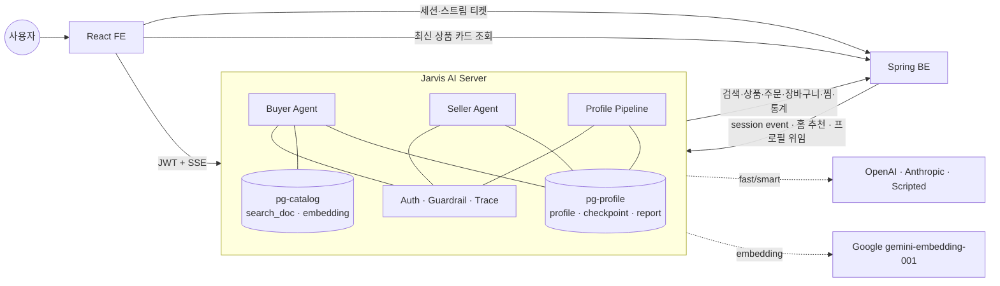

# 🛒 Jarvis — 에이전틱 커머스 AI 서버

> 자연어 쇼핑 요청을 **검증 가능한 검색·추천·커머스 행동**으로 연결하는 AI 에이전트 서버.
> 구매자, 판매자, 개인화 에이전트와 평가·관측 파이프라인을 제공한다.

<p>
  <a href="https://github.com/toss-delta-final/jarvis-ai/actions/workflows/ci.yml"></a>
  
  
  
  
  
</p>

---

## 프로젝트 개요

Jarvis는 “유럽 여행에서 기내에 들고 갈 파우치와 어댑터를 총 8만 원 아래로 추천해 줘”처럼
상황·복수 니즈·예산이 섞인 요청을 구조화한다. 최신 상품 후보는 Spring에서 조회하고, AI 검색
산출물과 개인화 프로필을 이용해 순서를 조정한 뒤, 검증된 상품 ID만 장바구니·찜·주문 조회 같은
후속 행동으로 연결한다.

핵심 원칙은 **LLM과 코드의 책임 분리**다.

- LLM은 자연어 의도, 니즈, 의미 적합성, 설명 초안을 해석한다.
- 코드는 인증·권한, hard constraint, 후보 ID, 중복, 근거, 멱등성, 타임아웃을 검증한다.
- 가격·재고·상품·주문·장바구니의 원본과 트랜잭션 권위는 Spring 백엔드가 유지한다.
- AI PostgreSQL에는 대화 상태, 프로필, 체크포인트, 검색 문서·임베딩 등 AI 산출물만 저장한다.

### 현재 구현 범위

| 영역 | 구현 내용 |
|---|---|
| **구매자 Agent** | 추천, 멀티턴 조건 누적·정정, 장바구니 담기·조회·삭제·수량 변경, 찜 추가·조회·삭제, 주문 상태 조회, 일반 대화 |
| **추천 파이프라인** | decompose → Spring 검색 → embedding rerank → LLM rerank → 결정론적 validator → 추천 목록 push |
| **판매자 Agent** | 통계 Q&A, 분석 보고서·차트, 상품 등록·수정·삭제 draft, 주문 발송 draft, 명시적 confirm 기반 실행 |
| **판매자 상주 분석** | 매출·전환·이탈·재구매·세그먼트 계산, 통계 검증, 보고서 저장, 예약/수동 실행 |
| **개인화** | 세션 신호 수집, 반복성·현저성·명시성 gate, 장기 취향 그래프, 조회·수정·삭제·초기화·중지/재개 |
| **품질·운영** | SSE 진행 상태, 취소·timeout·retry·degrade, 구조화 로그·LangSmith 추적, rate limit, 평가 하네스 |

---

## 시스템 아키텍처


```mermaid
flowchart LR
    User((사용자)) --> FE[React FE]
    FE -- 세션·스트림 티켓 --> Spring[Spring BE]
    FE -- JWT + SSE --> AI
    FE -- 최신 상품 카드 조회 --> Spring

    subgraph AI[Jarvis AI Server]
        Buyer[Buyer Agent]
        Seller[Seller Agent]
        Profile[Profile Pipeline]
        Guard[Auth · Guardrail · Trace]
        Catalog[(pg-catalog\nsearch_doc · embedding)]
        ProfileDB[(pg-profile\nprofile · checkpoint · report)]
        Buyer --- Guard
        Seller --- Guard
        Profile --- Guard
        Buyer --- Catalog
        Buyer --- ProfileDB
        Seller --- ProfileDB
        Profile --- ProfileDB
    end

    AI -- 검색·상품·주문·장바구니·찜·통계 --> Spring
    Spring -- session event · 홈 추천 · 프로필 위임 --> AI
    AI -. fast/smart .-> LLM[OpenAI · Anthropic · Scripted]
    AI -. embedding .-> Gemini[Google gemini-embedding-001]
```

### 추천 결과 표시: 경로 B

1. FE가 Spring에서 발급받은 스트림 티켓으로 `POST /chat`을 호출한다.
2. AI가 검증된 JWT `sub`에서 신원을 도출하고 추천 후보를 계산한다.
3. AI가 최종 상품 ID 목록을 Spring에 push한다.
4. AI는 SSE에 상품 카드를 싣지 않고 `products.ready` 상관키만 보낸다.
5. FE가 Spring에서 최신 가격·재고·이미지가 포함된 카드를 조회한다.

이 구조는 AI가 오래된 표시 데이터를 복제하지 않게 하고, 상품 표시 권위를 Spring에 일원화한다.

### 기본 검색·재랭킹 흐름

```text
자연어 + 최근 대화 + 장기 프로필
  → 의도/조건/니즈/semantic query 분해
  → Spring 최신 후보 검색
  → Google query embedding + pgvector 후보 재정렬
  → LLM rerank 및 구조화 근거 생성
  → hard constraint·후보 ID·중복·근거 validator
  → Spring I-21 목록 push
  → products.ready
```

기본 검색 백엔드는 `embedding_rerank`다. Query embedding이나 catalog artifact를 사용할 수 없으면
Spring 검색 순서를 유지하는 degrade 경로로 내려가며, 구조화 필터와 최신 가격·재고의 권위는 항상
Spring에 남는다. 비교용 `spring`, `vector` 백엔드도 구현되어 있지만 `vector`는 오프라인 평가용이다.

---

## 기술 스택

| 영역 | 기술 | 역할 |
|---|---|---|
| Runtime | Python 3.12, uv | async 실행과 lockfile 기반 재현성 |
| API | FastAPI, Uvicorn, SSE | 사용자/내부 API와 스트리밍 |
| Agent | LangGraph, provider-agnostic agent orchestration | 구매자 상태·분기와 LLM/tool 조율 |
| Schema | Pydantic v2 | camelCase 와이어 계약과 내부 snake_case 정합 |
| LLM | OpenAI, Anthropic, ScriptedLLM | fast/smart tier, 로컬·부하 테스트용 결정론 provider |
| Embedding | Google `gemini-embedding-001` | 1,536차원 검색 임베딩 |
| Data | PostgreSQL ×2, pgvector, psycopg | catalog artifact와 profile/checkpoint/report 분리 |
| Seller analytics | pandas, SciPy, statsmodels, scikit-learn | 시계열·비율·이상치·군집 계산 |
| Quality | pytest, Ruff, eval harness | 회귀, 정적 검사, 확률적 품질 평가 분리 |

LLM 모델 ID, 추론 강도, 가격표와 실험 arm은 코드에 고정하지 않고 [`.env.example`](.env.example)과
`app/core/config.py`에서 주입한다.

---

## 프로젝트 구조

```text
app/
├── main.py                         # FastAPI 팩토리, lifespan, middleware, /health
├── api/                            # chat, seller, events, internal, profile graph
├── agents/
│   ├── buyer/
│   │   ├── recommendation/         # decompose, 검색, 완화, rerank, grounding
│   │   ├── cart/                   # 담기·조회·삭제·수량·찜·옵션
│   │   ├── graph.py                # intent router와 buyer lane 조율
│   │   ├── memory.py               # 같은 방 최근 대화·상황 요약
│   │   └── order_status.py         # 주문 상태 응답
│   ├── seller/                     # 분석·도구·draft/HITL·report·상주 분석 SOP
│   └── profile/                    # 세션 finalizer, gate, 취향 그래프, 저장소
├── core/                            # 설정, 인증, 스트림, 관측, PII, rate limit
├── pipelines/                       # catalog pull, enrichment, embedding, scheduler
├── services/                        # Spring client, 검색 backend, 홈 추천
└── schemas/                         # 공개/내부 API와 SSE Pydantic 모델

db/                                  # pg-catalog·pg-profile 초기화/마이그레이션
evals/                               # 추천·필터·grounding·성능·판매자 평가 하네스
tests/                               # unit, integration, eval, smoke
docs/                                # API 계약, SPEC, 운영·평가·최종 보고서
deploy/                              # 데모 compose와 배포 보조 파일
scripts/                             # 데이터 적재·검증·평가·운영 도구
```

---

## 시작하기

### 요구 사항

- Python 3.12
- [uv](https://docs.astral.sh/uv/)
- Docker + Docker Compose
- 전체 채팅 통합 시 실행 중인 Spring 백엔드와 선택한 LLM provider 키

### 로컬 실행

```bash
# 1. 의존성 설치
uv sync

# 2. 환경변수 준비
cp .env.example .env

# 3. AI 저장소 기동 (host: catalog 5433, profile 5434)
docker compose up -d pg-catalog pg-profile

# 4. 개발 서버
uv run uvicorn app.main:app --reload --port 8000
```

```bash
curl http://localhost:8000/health
# {"status":"ok"}
```

- OpenAPI UI: `http://localhost:8000/docs`
- 전체 Docker 실행: `docker compose up --build`
- 배포·운영 설정: [`DEPLOY.md`](DEPLOY.md)

> `AUTH_MODE=dev`에서는 로컬 편의를 위해 무토큰 요청을 게스트로 처리한다. 운영에서는
> `AUTH_MODE=jwks`와 `JWKS_URL`, `JWT_ISSUER`, `JWT_AUDIENCE`, `JWT_SCOPE`,
> `INTERNAL_API_TOKEN`, `PII_HASH_PEPPER`를 올바르게 주입해야 한다.

### 주요 환경변수

| 변수 | 설명 |
|---|---|
| `LLM_PROVIDER` | `openai`(기본), `anthropic`, `scripted` |
| `OPENAI_API_KEY` / `ANTHROPIC_API_KEY` | 선택한 채팅 provider 인증 |
| `GOOGLE_API_KEY` | catalog 증분 embedding 및 query embedding |
| `SPRING_BASE_URL` | AI가 역호출할 Spring 주소 |
| `INTERNAL_API_TOKEN` | AI↔Spring `X-Internal-Token` 공용 값 |
| `CATALOG_DB_URL` / `PROFILE_DB_URL` | 두 PostgreSQL 연결 문자열 |
| `AUTH_MODE` / `JWKS_URL` | 로컬 dev 또는 RS256/JWKS 인증 모드 |
| `RERANK_GROUNDING_ARM` | 추천 근거 표시 arm, 기본 `validated` |
| `RERANK_RANKING_ARM` | 순위 계산 arm, 기본 `current` |
| `LANGSMITH_TRACING` | 선택적 LangSmith trace 전송 |

전체 설정과 안전한 기본값은 [`.env.example`](.env.example)을 참조한다.

---

## API 표면

### 사용자·판매자 API

| 메서드 | 경로 | 설명 |
|---|---|---|
| `POST` | `/chat` | 구매자 Agent SSE — 추천·장바구니·찜·주문·일반 대화 |
| `POST` | `/seller/chat` | 판매자 Agent SSE — 분석·상품/주문 draft·confirm |
| `GET` | `/seller/reports` | 저장된 판매자 분석 보고서 목록 |
| `GET` | `/seller/reports/{report_id}` | 판매자 분석 보고서 상세 |
| `GET`, `HEAD` | `/health` | 컨테이너·업타임 헬스 체크 |

### Spring → AI 내부 API

| 메서드 | 경로 | 설명 |
|---|---|---|
| `POST` | `/events/session-claim` | guest 세션을 회원에게 귀속 |
| `POST` | `/events/session-end` | logout/newConversation 프로필 finalizer 트리거 |
| `POST` | `/internal/recommendations/home` | 홈 개인화 추천 랭킹 위임 |
| `POST` | `/internal/seller/{brand_id}/analysis/run` | 판매자 분석 수동 실행(202 Accepted) |
| `GET` | `/internal/profile/{user_id}/graph` | 취향 그래프 조회 |
| `PATCH`, `DELETE` | `/internal/profile/{user_id}/graph/edges/{edge_id}` | 취향 수정·삭제 |
| `POST` | `/internal/profile/{user_id}/graph/reset` | 취향 그래프 전체 초기화 |
| `PUT` | `/internal/profile/{user_id}/personalization` | 개인화 중지·재개 |

정확한 요청·응답, 인증, 오류 코드와 SSE 순서는 [`docs/api-spec.md`](docs/api-spec.md)가 저장소의
동기화 사본이다. 계약 변경은 정본 개정 후 코드와 이 사본을 함께 갱신한다.

### SSE 이벤트

- 구매자: `progress`, `token`, `conditions`, `suggestions`, `action`, `products.ready`, `done`, `error`
- 판매자: `meta`, `progress`, `token`, `draft`, `report`, `done`, `error`

모든 프레임은 `data: {"type": "...", "data": {...}}` 형태의 camelCase JSON이다.

---

## 검증과 평가

```bash
# CI와 같은 기본 검증
uv run ruff check
uv run pytest

# 구매자 adversarial dataset 무결성
uv run python scripts/validate_dataset.py
uv run python -m evals.adversarial_recommendation.generator --check
```

README 갱신 기준 최신 `origin/dev`에서 기본 pytest 선택 집합은 **7,453 passed / 229 deselected**다.
기본 설정은 외부 과금 API를 호출하지 않으며, 실제 provider·인프라가 필요한 검증은 `smoke`,
`integration`, `slow` marker로 분리한다.

주요 평가 자산:

- 210 family, 450 minimal-mutation case의 구매자 adversarial dataset
- 추천 근거 A/B/C grounding 평가와 결정론적 validator
- ranking holdout, blind pairwise 수집·분석 도구
- intent, filter axis, category, needs, personalization, latency/cost probe
- 판매자 trigger·이상치·군집 안정성 회귀

평가 수치의 해석 범위와 재현 규약은 [`evals/README.md`](evals/README.md)와
[`docs/final-report/`](docs/final-report/)에서 확인한다.

---

## 문서

- [`docs/api-spec.md`](docs/api-spec.md) — API/SSE 계약 동기화 사본
- [`docs/specs/`](docs/specs/) — Buyer, Seller, Profile, Catalog 상세 SPEC
- [`docs/final-report/`](docs/final-report/) — 최종 보고서 원본·PDF·근거 원장
- [`docs/local-integration-guide.md`](docs/local-integration-guide.md) — Spring/DB 연동 가이드
- [`DEPLOY.md`](DEPLOY.md) — Docker/GHCR/EC2 배포와 운영 설정
- [`CHANGELOG.md`](CHANGELOG.md) — 기능·계약·평가 변경 이력

---

## 개발 워크플로

- 일상 작업: 최신 `dev`에서 topic branch 생성 → `dev` 대상 PR
- 배포: `dev → main` 승격 PR; `main` push가 EC2 배포를 실행
- PR 검증: GitHub Actions `lint-test`에서 Ruff + pytest
- 커밋 전 로컬 검증: `uv run pre-commit install`
- 커밋 형식: Conventional Commits (`feat`, `fix`, `docs`, `refactor`, `test`, `chore` 등)

---

## 라이선스

[MIT License](LICENSE)
