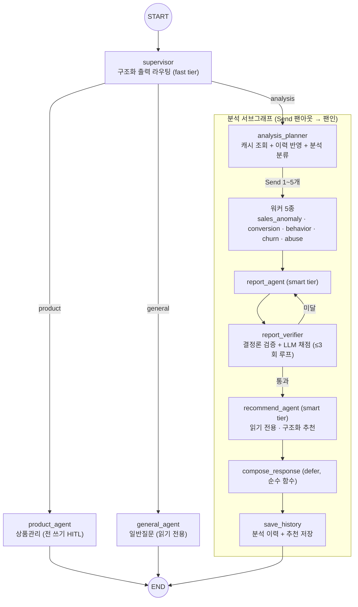

# SPEC-SELLER-001 — 판매자 멀티에이전트 그래프

> **버전**: v1.1.4 (라우팅 오류 meta-first 정합, 2026-07-23) · **상태**: MVP 구현 완료(1~4-3단계) — **정본 승격(기획 저장소 `.moai/specs/`) 은 미완**
> **현재 상태 문서**: 워크플로우 [SELLER-FINAL-WORKFLOW](SELLER-FINAL-WORKFLOW.md) · 기술 [SELLER-FINAL-TECH](SELLER-FINAL-TECH.md) · 미결 [SELLER-FINAL-RISKS](SELLER-FINAL-RISKS.md) · 확장 [SELLER-FINAL-ROADMAP](SELLER-FINAL-ROADMAP.md)
> **소유 코드**: `app/agents/seller/` · `app/api/seller.py` · `app/services/spring_client.py`(판매자 함수군)
> **상위 계약**: [`../api-spec.md`](../api-spec.md) §3.2(SSE·HITL) · §4.4(집계 7종) · §4.5(상품 CRUD 4종) — 본 SPEC과 어긋나면 **api-spec 우선**.
> **원 설계**: 『판매자 AI챗 멀티에이전트 설계서 v3』(2026-07-15, 01_LangGraph 수업자료 패턴 기반) — 본 SPEC은 이를 jarvis-ai 계약·규칙에 정합하도록 개정한 판이다. 변경분은 §1 정합 조정표 참조.
> **확정 근거** (2026-07-17 검토): ① 모든 쓰기 HITL(설계서의 "삭제만"은 의도된 완화 아님) ② 추천 적용은 draft 경유 ③ 계산 3층 분담(Spring=단순 수치, AI=고도화 계산·해석) ④ 90s는 목표치(비동기·병렬로 단축, 하드 컷 아님) ⑤ 설계서의 그래프 층만 이식, 인프라 층은 폐기 ⑥ 판매자 분석 이력은 구매자 취향 프로필과 완전 별개.

---

## 0. 범위

- **범위**: `POST /seller/chat` 그래프 내부 로직 전체 — supervisor 라우팅, 분석 서브그래프(워커 5종 · 보고서 · 검증 루프 · 행동 추천), 상품관리(HITL 쓰기), 일반질문, 판매자 분석 이력 저장·조회, RAG 지식 베이스, 일관성 장치.
- **비범위**: 리뷰 인사이트(고도화 — roadmap) · 차트 이미지 전달(계약 미정 — §12) · 판매자 FE 직접 상품편집(FE↔Spring, AI 표면 밖) · 구매자 취향 프로필(SPEC-PROFILE-001 — 본 SPEC과 무관, §9.3).

## 1. 설계서 v3 → 본 SPEC 정합 조정표

설계 문서를 SPEC으로 편입하며 계약/리포 규칙과 충돌한 지점을 조정했다. **구현 시 설계서 원문이 아니라 아래 확정안을 따른다.**

| # | 설계서 v3 | 본 SPEC 확정 | 근거 |
|---|---|---|---|
| 1 | 삭제만 HITL(`interrupt`), 수정·재고는 즉시 실행 | **모든 쓰기(등록/수정/삭제) HITL** — draft → 구조화 confirm → 실행 (§6) | api-spec §3.2 [HARD] · 2026-07-17 확정 |
| 2 | "1번 적용해줘" 발화 → LLM이 대화 재해석 → 즉시 실행 | 저장된 구조화 추천 조회 → **draft 경유** (§6.3) | 발화 ≠ 동의 [HARD] |
| 3 | 자체 FastAPI 데이터 API + `ai_reader` 계정 MySQL 직접 SELECT | **spring_client → Spring internal API**(I-6~I-16). AI는 MySQL 미접속 | 아키텍처 확정(질의 시점 콜백, §2.3) |
| 4 | `PATCH /products/{id}/stock` 별도 재고 API | **I-11에 통합** — 재고 포함, 별도 API 없음 | api-spec §4.5 |
| 5 | `seller_id`를 경로·도구 인자로 LLM이 채움 | **`brandId`=JWT 클레임**을 path에, 도구 시그니처에서 신원 인자 제거(주입) | api-spec §2.3·§2.6 (IDOR 방지) |
| 6 | `init_chat_model("openai:gpt-4o-mini")` | **provider 토글 2-tier** — `fast`/`smart`, OpenAI 기본·Anthropic 전환 (§8) | 이슈 #40·#82 · README · pyproject |
| 7 | `OpenAIEmbeddings`(text-embedding-3-small) | 셀프호스트 한국어 임베딩(arctic-embed-ko, 1024-dim, `--group embedding`) | 결정 6 |
| 8 | `config/analysis_config.py` 하드코딩 dict | `app/core/config.py` **Settings 주입** | 튜너블 하드코딩 금지(CLAUDE.md) |
| 9 | 도구 httpx `timeout=10` | AI→Spring 전 구간 **3s** | api-spec §2.9 c |
| 10 | `MemorySaver` / `InMemoryStore` | **PostgresSaver / PostgresStore** (처음부터) | mvp-plan 7번 · 의존성 설치됨 |
| 11 | 독립 `seller_agent/` 프로젝트 구조(app.py·api/·db.py) | `app/agents/seller/`로 그래프 층만 이식, 인프라 층 폐기 (§11) | 2026-07-17 확정 ⑤ |
| 12 | chart_agent PNG 저장 → 경로 반환 | **MVP 보류** — SSE 이벤트 4종에 전달 경로 없음 (§12 🔴) | api-spec §3.2 이벤트 제한 |

설계서의 그래프 위상(supervisor 구조화 출력 라우팅, Send 팬아웃, 검증 루프, defer 팬인), 상태·스키마 설계, 일관성 8장치, RAG 파이프라인, 프로필 반영 3지점은 **그대로 채택**한다.

## 2. 그래프 구조



- 서브에이전트 구성은 api-spec §8 항목 8과 일치: sales_anomaly · conversion · behavior · churn · abuse · general · recommend · (chart — 보류) · **product_agent**.
- chart_agent는 전달 계약 확정 전까지 그래프에서 **비활성**(feature flag, §12). 설계서의 "chart ∥ recommend 병렬 팬아웃"은 계약 확정 시 복원한다(`defer=True` 팬인 구조는 유지).
- **진행 상황 token**: planner·워커·report 등 단계 진입 시 짧은 안내 텍스트("매출 이상 분석 중…")를 `token`으로 emit — first-token 10s(§2.9) 충족 + 장시간 분석의 체감 대기 완화.

## 3. 상태·스키마

설계서 §2.4~2.5의 `SellerState` / `AnalysisTaskState` / `RouteDecision` / `AnalysisPlan` / `AnalysisFinding` / `ReportScore` / `ActionRecommendation` / `RecommendationSet`을 준용하되 다음을 조정한다.

- **신원**: `sellerId`(JWT `sub`)·`brandId`(JWT 클레임)는 `require_seller`가 검증한 `Identity`에서 확보해 그래프 config/state로 주입한다. **어떤 도구 시그니처에도 신원 파라미터를 두지 않는다** — LLM이 신원 인자를 생성할 수 없어야 한다(클로저 또는 `InjectedState`).
- **draft**: api-spec §3.2의 `draft{draftId, op: update|create|delete, productId, changes[{field,before,after}]}` 를 그대로 쓴다. `before`의 소스는 I-9 목록 조회.
- **캐시**: `cache_hit: NotRequired[bool]` 추가(시맨틱 캐시 히트 시 파이프라인 스킵, §10-⑧).
- 와이어에 노출되는 모든 페이로드는 CamelModel(by_alias) — 내부 state 키는 snake_case 유지.

## 4. 데이터 계층 — 도구 ↔ spring_client ↔ Spring 매핑

설계서의 "FastAPI 데이터 API"는 존재하지 않는다. 모든 @tool은 `spring_client` 함수의 얇은 래퍼다(응답을 문자열 요약으로 반환, 오류는 raise 대신 `"Error: ..."` 문자열 — 에이전트 자가수정 유도는 설계서 관례 유지).

| @tool | spring_client 함수 | Spring API | 소비 노드 |
|---|---|---|---|
| `get_sales_timeseries` | `get_seller_sales` (신설) | I-6 `GET /internal/seller/{brandId}/sales` | sales_anomaly · general |
| `get_funnel` | `get_seller_funnel` (신설) | I-7 `.../funnel` | conversion · behavior |
| `get_behavior_events` | `get_seller_events` (신설) | I-13 `.../events` | behavior · abuse |
| `get_order_events` | `get_seller_order_events` (신설) | I-14 `.../order-events` | sales_anomaly · churn · abuse · general |
| `get_product_change_logs` | `get_seller_product_changes` (신설) | I-15 `.../product-changes` | sales_anomaly · churn · recommend |
| `get_churn_cohort` | `get_seller_churn` (신설) | I-16 `.../churn` | churn |
| `get_account_events` | `get_account_events` (신설) | I-8 `/internal/account-events` **🔴 admin 소유 협의** | abuse · churn |
| `list_my_products` | `list_seller_products` (신설) | I-9 `GET .../products` | product_agent(before) · recommend · general |
| `create_product` | `create_seller_product` (신설) | I-10 `POST .../products` | product_agent **전용** |
| `update_product` | `update_seller_product` (신설) | I-11 `PATCH .../products/{productId}` — **재고 포함** | product_agent **전용** |
| `delete_product` | `delete_seller_product` (신설) | I-12 `DELETE .../products/{productId}` — soft(`HIDDEN`) | product_agent **전용** |

- 인증·타임아웃: 전부 `X-Internal-Token` + `{brandId}`(JWT 클레임) + **3s** (api-spec §2.3 방식2·§2.9 c).
- **쓰기 도구 3종은 product_agent에만 배정** — 분석·추천·일반 에이전트는 GET 계열만(설계서 §3.3-④ 유지). 오분류돼도 데이터 변경 원천 불가.
- **degrade**: 조회 실패/3s 초과 → 해당 워커는 `severity=info`의 "데이터 확보 실패" finding을 반환하고 파이프라인은 계속(부분 보고서). 전 워커 실패 시 `token`으로 안내 후 `done`. 쓰기 실패(I-10/11/12 오류) → `token`으로 실패 사유 안내, 스트림은 `done` 종료(`error` 아님).
- 기존 스텁 `get_seller_aggregates`·`get_product_detail`(구계약 v0.7.0 기준)은 위 함수군으로 **대체·삭제**하고 docstring의 "FE S-3 PATCH" 서술을 정리한다.
- I-8(account-events)는 admin 소유 협의(🔴) 확정 전까지 abuse 워커는 I-13/I-14 조합을 대체 소스로 사용한다.

## 5. 계산 3층 분담 (2026-07-17 확정)

**Spring은 로그의 단순 수치만 계산하고, 고도화 계산과 해석은 AI가 한다.**

| 층 | 담당 | 형태 | 예 (매출이상탐지) |
|---|---|---|---|
| **Spring (단순 수치)** | 로그 기초 집계 — 시계열 합산, 퍼널 단계 카운트, 이벤트 집계 | I-6~I-16 응답 | 일별 매출액·주문수 시계열 |
| **AI 고도화 계산 (코드)** | 이동평균·편차·이상 판정·전환율 비교·코호트 파생 — 임계값은 Settings 주입 | `app/agents/seller/` 내 pandas/순수 함수 | `deviation_pct=-42.1`, `is_anomaly=True` 판정 |
| **LLM (해석)** | 원인 가설·의미 부여·서술 — 코드 판정을 재계산·번복 금지(프롬프트 명시) | 분석 워커 | "급락 3일이 광고 중단 직후와 겹침 — 유입 감소 가설" |

- 임계값(이동평균 window, deviation %, 무활동 일수, abuse 룰 등)의 **단일 출처는 `app/core/config.py`** — 설계서의 `ANALYSIS_CONFIG` dict를 Settings 필드로 이관, 프롬프트·기준서에 숫자 하드코딩 금지.
- RAG 기준서(§10-③)는 임계값의 **의미·해석 규칙만** 기술한다. config와 기준서의 동기화는 기준서 갱신 체크리스트로 관리.
- **🔴 C-13 협의 필수 — 계산 경계표**: api-spec §4.4 초안은 I-6이 `isAnomaly`·`deviationPct`까지 반환한다고 적혀 있어 본 분담과 어긋난다. C-13 협의에서 "Spring이 어느 수치까지 계산하나"를 경계표로 확정하고, I-6 응답의 판정 필드는 **제거 또는 참고치로 강등**하도록 명세를 개정한다(정본 먼저).

## 6. 상품관리 — 모든 쓰기 HITL

### 6.1 2-스트림 흐름 (api-spec §3.2 확정안 준수)

SSE 1스트림 = 응답 1회이므로 승인 대기를 한 연결에 물지 않는다.

```
[스트림 1 · 제안]  진행 token → (I-9로 before 확보) → draft{draftId, op, productId, changes[]}
                   → LangGraph interrupt (상태는 PostgresSaver checkpoint) → done
                   FE: diff 카드 + [적용]/[취소]
[스트림 2 · 실행]  FE가 confirm{action:"confirm", draftId} 전송 → 그래프 resume
                   → I-10/I-11/I-12 호출 → token(결과 안내) → done
```

### 6.2 안전장치 5종 [HARD — api-spec §3.2]

1. **draftId 바인딩** — confirm은 draftId를 참조, "보여준 diff == 실행하는 쓰기" 보장. 실제 변경분은 checkpoint가 보유.
2. **명시 액션만 승인** — confirm은 구조화 신호. 자유 텍스트("응 바꿔", "1번 적용해줘")는 승인이 아니다(**발화 ≠ 동의**).
3. **멱등성** — 동일 draftId 재confirm은 1회만 실행(더블클릭 방지).
4. **Spring 소유권 하드 게이트** — HITL을 우회해도 Spring이 `brandId`로 귀속 검증. HITL은 사람-안전, Spring authz가 최종 방어.
5. **대기 TTL** — 미승인 draft는 N분(Settings 주입) 후 만료. 만료된 draftId confirm은 재제안 안내.

### 6.3 추천 적용 흐름 (설계서 §4.2.6 개정)

"N번 적용해줘"는 실행 명령이 아니라 **쓰기 요청**으로 취급한다.

1. supervisor → product 라우팅.
2. product_agent는 **대화 텍스트를 재해석하지 않고**, save_history가 저장한 구조화 `recommendations[N-1]`(대상 productId·금액·문구 초안)을 분석 이력 store에서 조회한다.
3. 해당 추천을 `draft{op:"update", changes[]}`로 변환해 emit → §6.1 흐름 합류.
4. 조회 실패(이력 없음·인덱스 불일치) 시 실행하지 않고 `token`으로 어떤 추천인지 되묻는다.

이로써 LLM의 복원 오류는 diff 카드 단계에서 판매자 눈으로 걸러지고, 실행 내용은 draftId에 바인딩된다.

### 6.4 삭제·재고

- 삭제 = I-12 soft delete(`status=HIDDEN`, 물리 삭제 없음) — HITL(그래프) + soft(데이터) 이중 방어. FE diff 카드에서 삭제만 문구 강조 권장.
- 재고 수정 = I-11 PATCH의 `stockQuantity` 필드(별도 API 없음). 역시 HITL 경유.

### 6.5 미결

- **🔴 confirm 전송 형식**(별도 요청 vs 특수 message)·HITL 승인 이벤트명 — BE/FE 협의(api-spec §3.2 명시). 확정 전에는 interrupt→resume 배선까지 구현하고 전송 계층은 스텁.

## 7. SSE·수명주기·degrade

- 이벤트는 **`meta` / `progress` / `token` / `draft` / `done` / `error` 6종**(§3.2). 모든 판매자 스트림은 `meta{lane}`으로 시작하고 정상은 `done`, 실패는 `error`로 끝난다. `done.finishReason="stop"` 단일. 구매자 이벤트(products.ready 등) emit 금지.
- supervisor가 provider 미구성으로 분류 전에 실패하면 새 wire lane을 추가하지 않고 기존 라우팅 장애 폴백인 **`meta{general}`을 먼저 보낸 뒤 `error{code:"LLM_UNAVAILABLE"}`**로 끝낸다. 운영 로그의 lane은 실패 지점 식별을 위해 `routing`을 유지한다.
- **first-token 10s**: supervisor 라우팅 직후 진행 token을 먼저 흘린다(§2).
- **상한 90s는 목표치**(2026-07-17 확정) — 분석 스트림은 초과 가능. 타임아웃은 Settings 주입으로 두고, Send 팬아웃 병렬화·`fast` 모델 티어·검증 루프 상한(≤3)으로 단축한다. 지속 초과 시 §2.9의 판매자 스트림 예외(상한 연장)를 명세 개정으로 제안 🔴.
- **degrade 규칙 요약**: 워커 일부 실패 → 부분 보고서 / verifier 3회 미달 → 마지막 보고서 채택 + 로그 / 집계 전부 실패 → 사과 token + done / 쓰기 실패 → token 안내 + done. LLM·Spring 실패가 스트림을 `error`로 끝내는 경우는 스트림 자체가 진행 불능일 때만.
- **provider 미구성은 degrade 대상이 아니다**: `LLMNotConfigured`는 전역 배포 설정 오류이므로 supervisor·planner·worker·report·recommend 어느 단계에서도 일반 워커 실패나 부분 보고서로 흡수하지 않고 API 경계까지 전파해 `LLM_UNAVAILABLE`로 끝낸다.
- **provider 미구성은 서버 오류 로그를 남긴다**: API 경계는 활성 provider·lane·threadId만 기록하고 API key나 예외 메시지의 비밀값은 기록하지 않는다. 동일 요청은 실제로 예외를 매핑한 단일 경계에서 한 번만 기록한다.
- 세션당 활성 스트림 1개(409)·취소 감지·대화 저장 상태는 §2.9 공통 구현을 따른다(구매자와 공유).

## 8. 모델 배정 (provider-neutral 2-tier)

| 역할 | tier | OpenAI(기본) | Anthropic |
|---|---|---|---|
| supervisor · analysis_planner · 분석 워커 5종 · report_verifier judge · product_agent | **fast** | `openai_fast_model_id`, `temperature` 미전달, `reasoning_effort=minimal` | `haiku_model_id`, `temperature=0.0` |
| report_agent · recommend_agent | **smart** | `openai_smart_model_id`, `temperature` 미전달, `reasoning_effort=medium` | `sonnet_model_id`, `temperature=0.2` |

- 근거: 라우팅·분류·정형 분석은 경량, 서술·추천 품질은 상위 티어 — 호출부는 provider 모델명이 아닌 `fast`/`smart` 의도만 선택한다.
- provider·모델 ID·API key·reasoning effort·Anthropic temperature는 Settings 주입이다. `LLM_PROVIDER` 기본은 `openai`이며 `anthropic`으로 전환할 수 있다. provider 값은 Settings 입력 경계에서 ASCII 대소문자를 구분하지 않고 소문자로 정규화하며(`OpenAI`→`openai`, `Anthropic`→`anthropic`), 그 밖의 값은 기동 전에 거부한다.
- OpenAI reasoning 모델에는 `temperature` 키 자체를 전달하지 않는다. 일관성 레버는 tier별 reasoning effort와 구조화 출력·코드 판정이다. Anthropic은 기존 `temperature=0.0/0.2` 정책을 유지한다.
- 모델 ID 변경은 일관성 관측 이벤트이므로 CHANGELOG에 기록한다(§10-①). 설정값이 alias이면 provider가 가리키는 snapshot이 바뀔 수 있으므로 “버전 고정”으로 간주하지 않는다.

## 9. 저장소

### 9.1 판매자 분석 이력 (seller analysis history)

- **용어 확정**: "프로필"이라 부르지 않는다 — 구매자 취향 프로필과의 혼동 방지.
- 저장소: **pg-profile(5434)** — PostgresStore 네임스페이스 `("sellers", {sellerId}, "analysis_history")` + 워커별 탐지 상세 테이블 `analysis_detections`.
- 저장 시점: compose 후 save_history 노드. 내용: 질문·analysis_types·기간·report 요약·**구조화 recommendations**(§6.3의 원천).
- 조회: analysis_planner가 최근 5건을 분류 프롬프트에 주입(설계서의 프로필 반영 3지점 유지 — planner/워커 query/report "이전 분석 대비" 절).
- 영속화는 AI 자기 소유 PG에 **직접 쓴다** — 설계서의 "FastAPI POST 경유"는 별도 프로세스 전제였으므로 폐기(그래프가 앱 안에서 실행됨).

### 9.2 RAG 지식 베이스 · 시맨틱 캐시

- 저장소: **pg-catalog(5433)** pgvector(확장 유지 중) — 컬렉션 `analysis_guides`(분석 기준서) · `policies`(판매 정책) · `product_docs`(상품 설명 가이드) · `question_cache`(시맨틱 캐시, metadata: sellerId·기간·참조키).
- 임베딩: 셀프호스트 한국어 모델(1024-dim, `uv sync --group embedding`) — I-8 배치 임베딩과 동일 모델 공유.
- 인제스트: `app/pipelines/seller_kb.py`(오프라인, 문서 갱신 시 재실행). 쓰기 권한은 인제스트 경로만 — 에이전트에는 검색 @tool만 노출.
- **산출물 의존 🔴**: `analysis_guides`의 원천인 **분석 기준서 문서 자체가 아직 없다** — 워커 구현 전 작성 필요(mvp-todo 등재).

### 9.3 구매자 취향 프로필과의 관계

무관하다. 구매자 취향 프로필(OKF 위키, SPEC-PROFILE-001)은 **소비자의 구매 취향**을, 판매자 분석 이력은 **판매자가 요청한 분석의 기록**을 담는다. 네임스페이스(`profile/*` vs `sellers/*`)·문서·코드 경로를 분리하고, 문서에서 "프로필"은 구매자 쪽에만 쓴다.

## 10. 일관성 장치 8종 (설계서 §6 유지 · 조정 반영)

| # | 장치 | 본 SPEC 조정 |
|---|---|---|
| ① | provider별 변동성 제어 | `fast` 라우터·워커·judge는 OpenAI `reasoning_effort=minimal` 또는 Anthropic `temperature=0.0`을 사용한다. 모델 ID 변경 시 기록(§8) |
| ② | 수치 계산의 코드 이전 | **3층 분담(§5)** — AI-측 고도화 계산 + Settings 임계값 |
| ③ | 기준서 RAG 고정 주입 | pg-catalog pgvector(§9.2)·한국어 임베딩. "분석 전 기준서 검색, 코드 판정 번복 금지" 프롬프트 강제 |
| ④ | 기간 정규화(`normalize_period`) | 유지 — "지난달"=전월 1일~말일, "최근 N일"=오늘 제외. 기준서에 동일 정의 문서화 |
| ⑤ | 구조화 출력 계약(Literal·ge/le) | 유지 |
| ⑥ | 가드레일 미들웨어(scope→PII→출력 검사) | 유지. PII는 리포 로깅 규칙(원문 로그 금지)과 정합 |
| ⑦ | 보고서 검증 루프(결정론→LLM 채점, 21/30, ≤3회) | 유지. 임계·횟수는 Settings 주입 |
| ⑧ | 시맨틱 캐시(question_cache) | 유지 — 유사도·동일 기간·당일이면 이전 보고서 반환(LLM 미실행), 아니면 이전 보고서 앵커 주입 |

## 11. 디렉터리 매핑 (설계서 §2.7 → jarvis-ai)

| 설계서 | jarvis-ai | 비고 |
|---|---|---|
| `app.py` /chat | `app/api/seller.py` `_stub_stream` 자리에 그래프 연결 | 라우터·403·SSE 헤더는 기존 것 |
| `graph/state.py` `schemas.py` `tools.py` `nodes.py` `conditions.py` `guardrails.py` `builder.py` | `app/agents/seller/` 동일 구성 | 스텁마다 api-spec §·본 SPEC § 참조 주석 |
| `api/routers/` `api/db.py` | **폐기** — spring_client(§4) | 데이터 API의 소유는 Spring |
| `config/analysis_config.py` | `app/core/config.py` Settings | |
| `rag/ingest.py` `retriever.py` | `app/pipelines/seller_kb.py` + `app/agents/seller/rag.py` | |
| `charts/` | 보류(§12) | |
| `.env`의 `MYSQL_URL` | **없음** — AI는 MySQL 미접속 | |

## 12. 미결(🔴) · 의존 목록

| 항목 | 내용 | 블로킹 대상 |
|---|---|---|
| C-13 | 집계 7종 응답 스키마 + **계산 경계표**(§5) + metric/기간 파라미터 값 집합 | 분석 워커 전체 |
| C-14 | CRUD 4종 정확 응답 스키마 · categoryId/attributes | product_agent |
| HITL confirm | 전송 형식(별도 요청 vs 특수 message)·이벤트명 — BE/FE | 스트림 2(실행) 전송 계층 |
| 차트 전달 | SSE 4종에 경로 없음 — 새 이벤트 or 파일 URL 계약 신설(정본 먼저) vs post-MVP 확정 | chart_agent 활성화 |
| I-8 account-events | admin 소유 협의 | abuse 워커 일부 소스 |
| 분석 기준서 | `analysis_guides` 원천 문서 작성(산출물) | RAG·워커 프롬프트 |
| 90s 초과 | 실측 후 §2.9 판매자 예외 개정 제안 여부 | 운영 |

## 13. 구현 순서 (mvp-todo §4와 정렬)

1. spring_client 판매자 함수군 신설 + 구계약 스텁 정리(§4) — 계약 미확정 구간은 § 참조 스텁 유지
2. general_agent(읽기 도구 + 계산기)로 도구 배선 검증
3. supervisor + 3분기 골격(더미 노드) — `get_graph(xray=True)` 구조 확인
4. 분석 기준서 작성 → seller_kb 인제스트 → `search_analysis_guide` @tool
5. 분석 서브그래프 — planner → 워커 1종(sales_anomaly)부터 → 5종 확장 → report
6. report_verifier 검증 루프
7. recommend_agent + compose + save_history(분석 이력)
8. product_agent HITL — draft emit → interrupt → confirm resume → I-10/11/12 (confirm 전송 계층은 🔴 확정 후)
9. 추천 적용 흐름(§6.3) E2E
10. 가드레일 + 일관성 회귀 테스트(같은 질문 10회 결론 일치율) + 시맨틱 캐시

각 단계는 `/implement-topic` 절차(계약 읽기 → TDD → ruff/pytest → Conventional Commit)를 따른다.

---

*문서 끝. 개정 시 CHANGELOG와 본 헤더 버전을 함께 갱신한다.*
